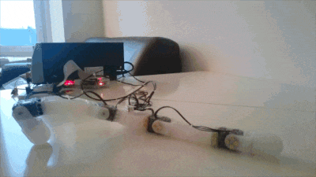

# Poppy Soft Starfish

poppy-soft-starfish is the first robot showcasing the use of [poppy-soft-connector](https://github.com/poppy-project/poppy-soft-connector) to create flexible robotic parts.

Discussion about this project are located on [this post](TODO) of [our forum](https://forum.poppy-project.org/).

## Quick information

Watch this [video]()

Look at the [doc folder](doc) for building instructions and help

Look at the [hardware folder](hardware) for the mechanical parts

Look at the [software folder](hardware) for code examples

### Contributing

Create your own soft robot and share it on [our forum](https://forum.poppy-project.org/)!

You can also propose new optimized design for the [poppy-soft-connector](https://github.com/poppy-project/poppy-soft-connector).

To contribute to this repository, you can [fork it](https://help.github.com/articles/fork-a-repo/) and issue a [pull request](https://help.github.com/articles/using-pull-requests/). [[Another useful link]](https://gun.io/blog/how-to-github-fork-branch-and-pull-request/)

### License

All the technological development work made in the Poppy project is freely available under open source licenses. Only the name usage *"Poppy"* is restricted and protected as an international trademark, please contact us if you want to use it or have more information.

|   License     |     Hardware    |   Software      |
| ------------- | :-------------: | :-------------: |
| Title  | [Creatives Commons BY-SA](http://creativecommons.org/licenses/by-sa/4.0/)  |[GPL v3](http://www.gnu.org/licenses/gpl.html)  |
| Logo  |   |  |
